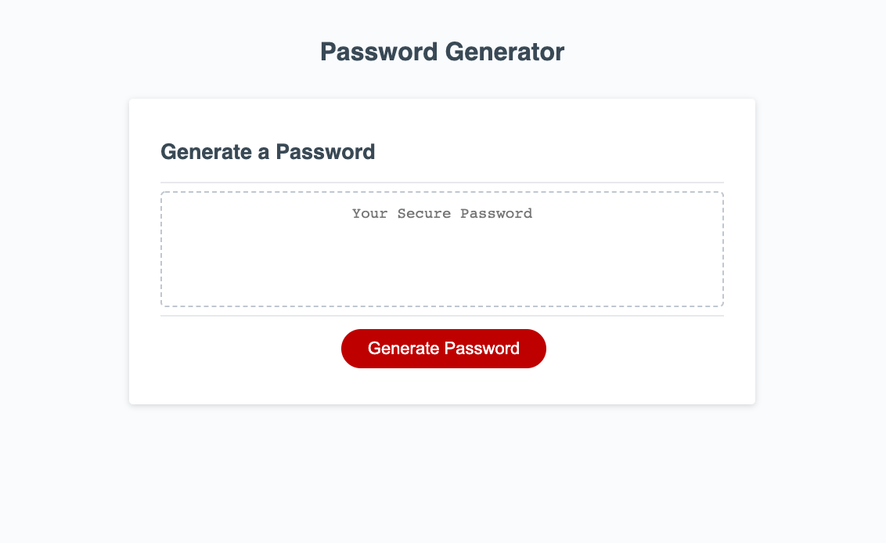
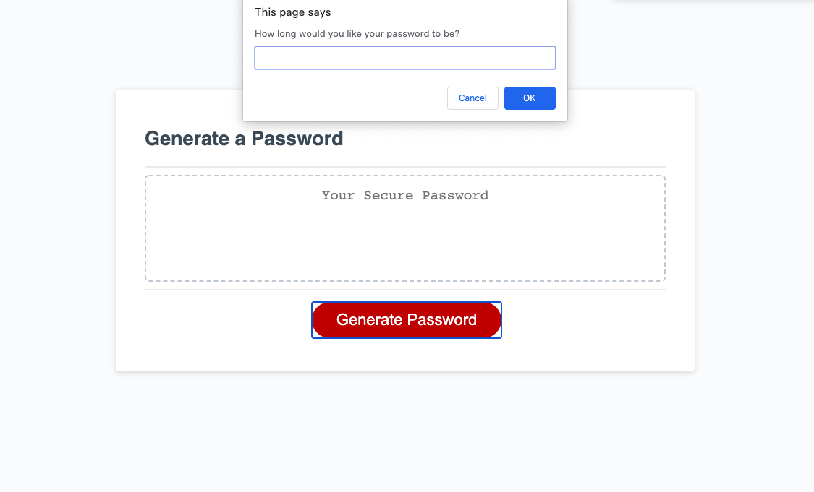
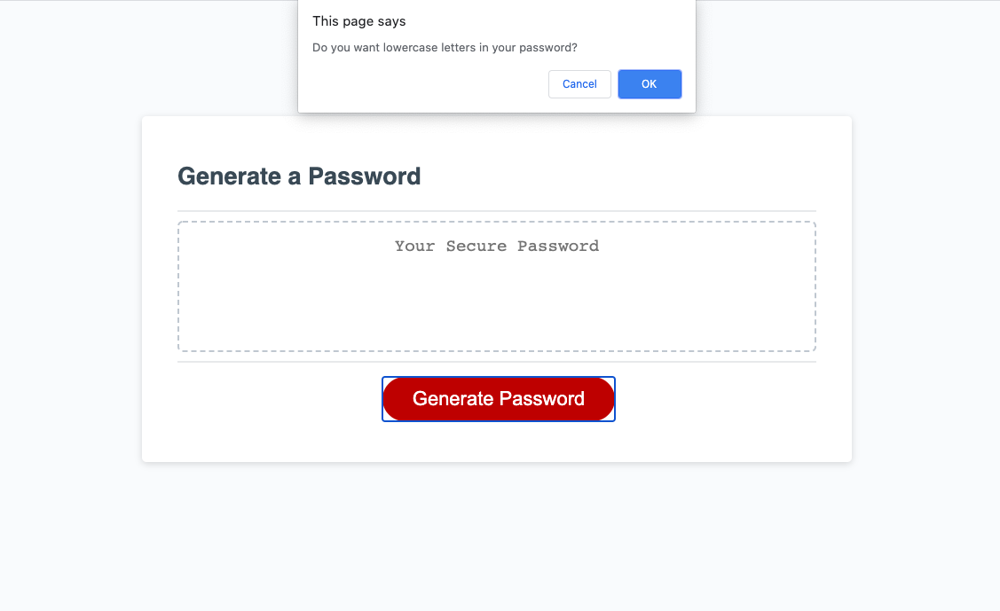
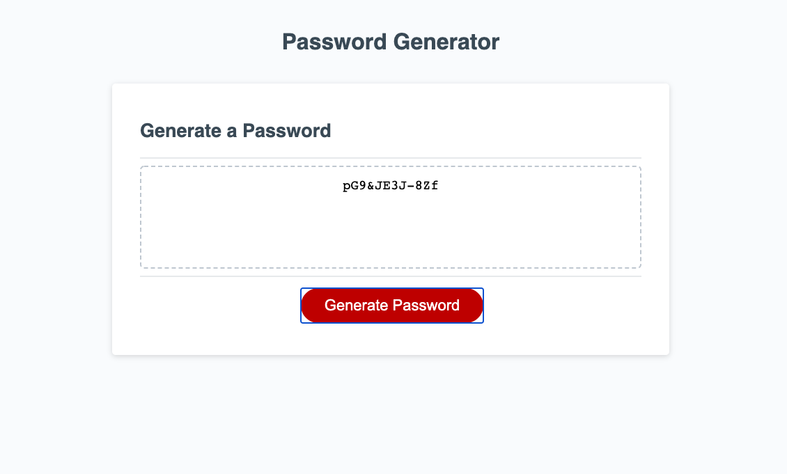

# password-generator
Password Generator 

Link: 

Description: 
A password generator created with JavaScript to generate a random password tailored to the person's needs. This website utilizes HTMl, CSS, and Javascript to create a random password generator. Once the "Generate Password" button is clicked, it enables pop-ups to specify what characters the user would like in their password(i.e. uppercase, lowercase, special,& numerical). This utilizes for loops and functions to create a randomized password based on the users preferences.

Screenshots:

Password Generator Home Page

Pop-up to specify desired length

Pop-up to specify desired characters 

Execution of random generated password

If you need support please email me at:
gnatalie.booking@gmail.com

